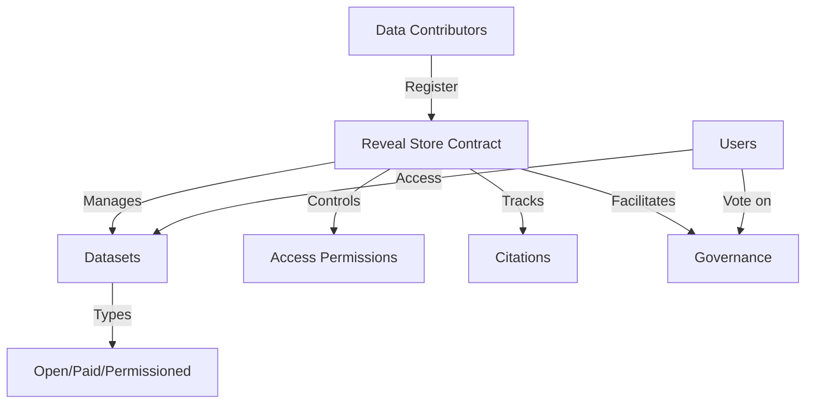

# Reveal Store

A decentralized platform for secure, transparent, and controlled data revelation across research domains.

## Overview

Reveal Store is a blockchain-powered platform designed to revolutionize data sharing by providing:
- Secure and immutable data metadata storage
- Flexible and granular access control mechanisms
- Transparent attribution and citation tracking
- Community-driven governance model
- Incentivized data revelation ecosystem

The platform enables researchers, data scientists, and domain experts to share, monetize, and collaborate on valuable datasets in a trustless, transparent environment.

## Architecture

The system leverages a robust smart contract infrastructure to manage:



### Core Components:
- Contributor Registry
- Dataset Management
- Granular Access Control
- Citation Tracking
- Decentralized Governance

## Contract Documentation

### reveal-store.clar

The core contract powering the Reveal Store ecosystem.

#### Key Features:
- Contributor registration and verification
- Dataset metadata registration
- Multi-tier access control strategies
- Transparent citation mechanisms
- Community-driven governance proposals

#### Access Types:
- `ACCESS-TYPE-OPEN` (u1): Publicly accessible data
- `ACCESS-TYPE-PAID` (u2): Requires economic access
- `ACCESS-TYPE-PERMISSIONED` (u3): Requires explicit authorization

## Getting Started

### Prerequisites
- Clarinet
- Stacks wallet for deployment/interaction

### Basic Usage

1. Register as a researcher:
```clarity
(contract-call? .reveal-store register-contributor "John Doe" "Research Institute" "Data Science Expert")
```

2. Register a dataset:
```clarity
(contract-call? .ocean-vault register-dataset 
    "dataset-001"
    "Coral Reef Survey 2023"
    "Environmental Data"
    "Great Barrier Reef"
    u1683849600
    "Standard sampling methodology"
    0x... ;; data hash
    u1    ;; open access
    u0    ;; free
)
```

3. Access a dataset:
```clarity
(contract-call? .ocean-vault check-dataset-access "dataset-001" tx-sender)
```

## Function Reference

### Public Functions

#### Researcher Management
- `register-researcher`: Register a new researcher
- `get-researcher`: Retrieve researcher information

#### Dataset Management
- `register-dataset`: Register a new dataset
- `verify-dataset`: Verify a dataset (admin only)
- `get-dataset`: Retrieve dataset information

#### Access Control
- `grant-dataset-access`: Grant access to permissioned dataset
- `access-paid-dataset`: Purchase access to paid dataset
- `check-dataset-access`: Check access permissions

#### Citations
- `cite-dataset`: Cite a dataset in research
- `get-citation`: Retrieve citation information

#### Governance
- `create-proposal`: Create a governance proposal
- `vote-on-proposal`: Vote on active proposals
- `finalize-proposal`: Finalize proposal after voting period

## Development

### Testing
1. Clone the repository
2. Install Clarinet
3. Run tests:
```bash
clarinet test
```

### Local Development
1. Start Clarinet console:
```bash
clarinet console
```
2. Deploy contracts:
```clarity
(contract-call? .ocean-vault ...)
```

## Security Considerations

### Access Control
- Only registered researchers can register datasets
- Dataset access is strictly controlled based on type
- Paid access requires successful STX transfer
- Permission grants only by dataset owners

### Governance
- Only registered researchers can participate
- Proposals have fixed voting periods
- Vote counting is transparent and immutable
- Status changes are permanent once finalized

### Limitations
- On-chain storage limited to metadata
- Actual dataset storage should be off-chain
- Access control applies to metadata only
- Citations must be by registered researchers